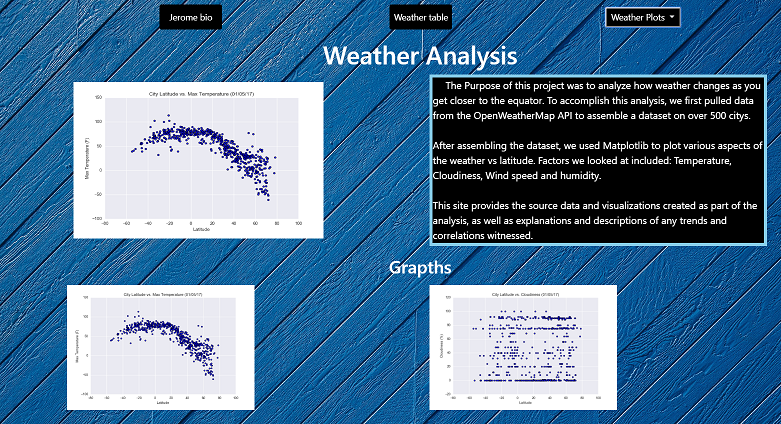

## Web Visualization website : https://jurioste4.github.io/weather/index.html 
Here I was tasked with createing a Visualization website  for my weather API analaysis 

click here to see the Analysis done : https://github.com/jurioste4/Python_api_homework

I used HTML/CSS D3 and some javaScript 
 
 so I used images from the plots that were created to evaulate 
 windspeed.png vs Latitude 
 
 
 so I created 7 total pages one for each graph 
 maxtemp, humidity cloudness , and a page to compair all of the graphs . 

Last I was tasked with createing a homepage: 

 
 

